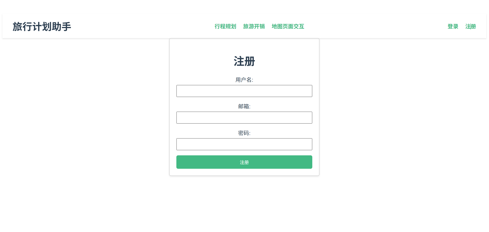
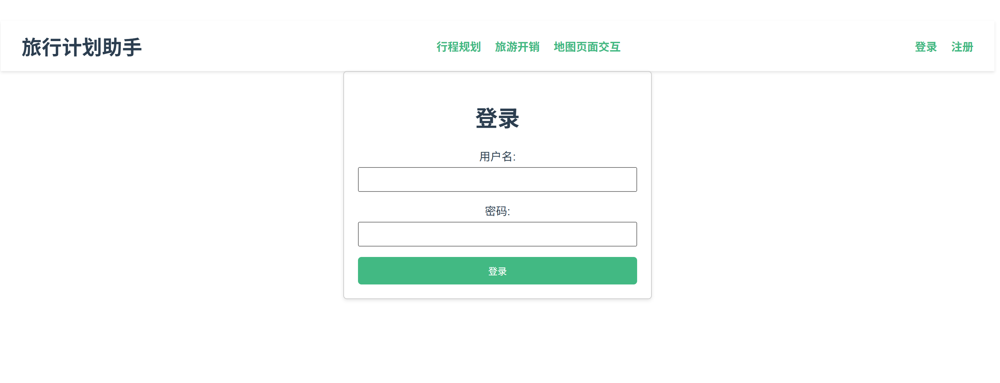
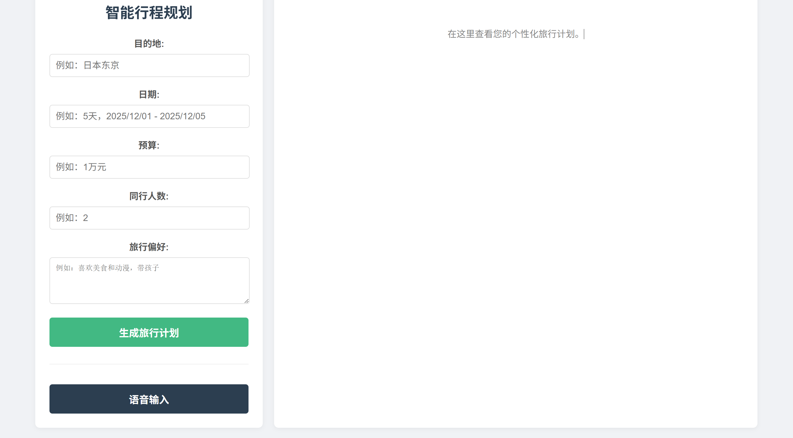
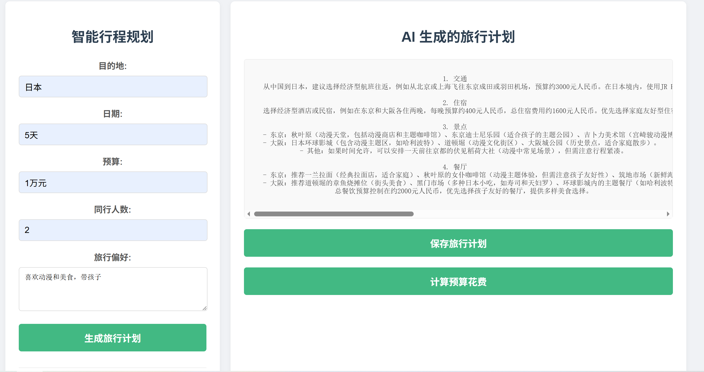
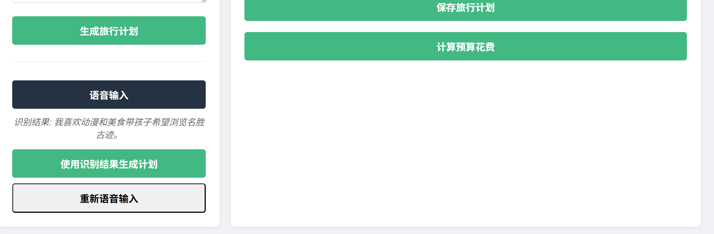
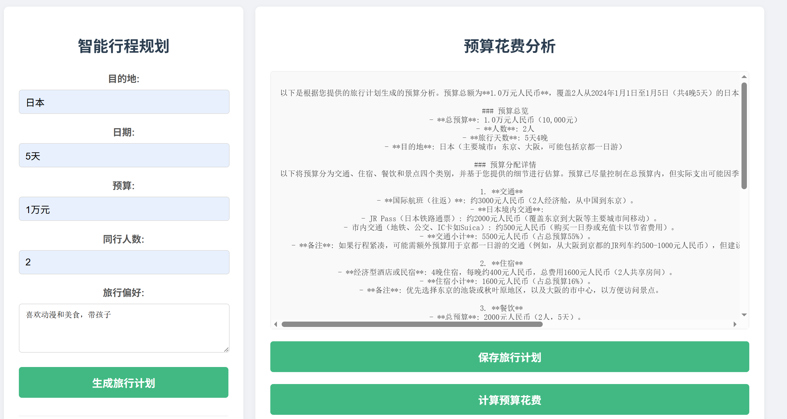
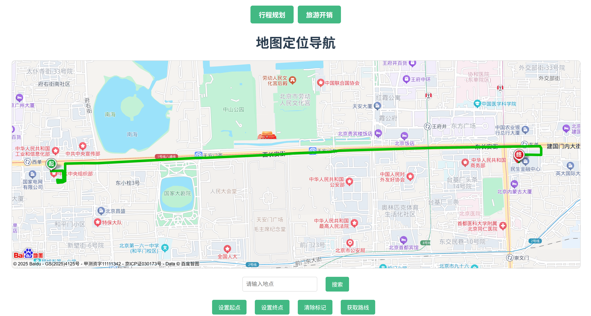
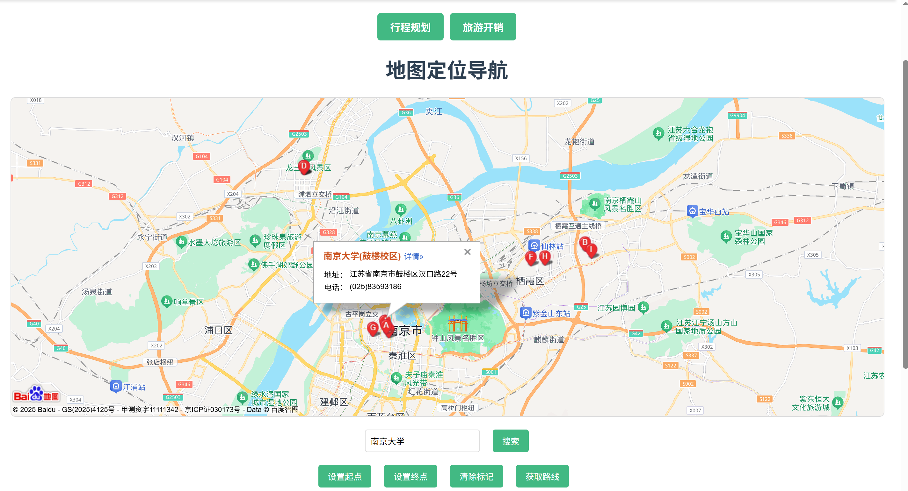
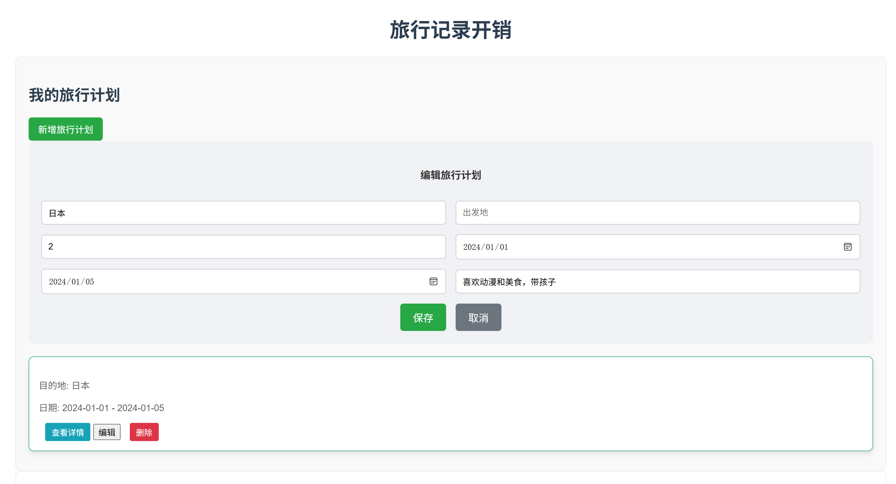
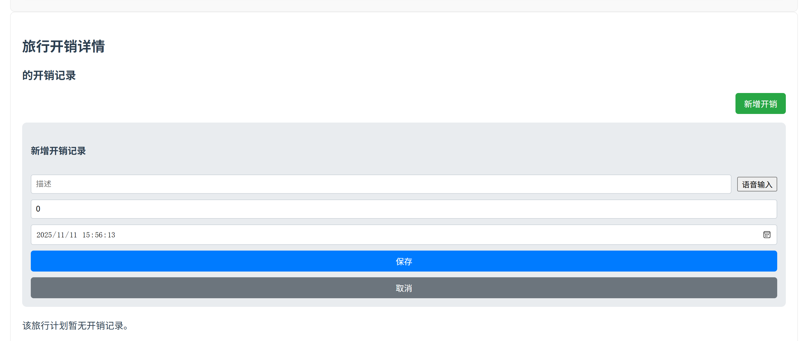

# 旅行规划应用

## 功能概述
这是一个旅行规划应用，旨在帮助用户轻松规划和管理他们的旅行。它集成了用户认证、AI 辅助规划和地图展示等功能，提供了一个全面的旅行规划体验。
https://github.com/FRANKGONGII/ai_helping_coding_travel.git

## 功能点介绍

### 1. 用户认证
- **注册与登录**: 用户可以创建账户并登录，以便保存和管理他们的旅行计划。



### 2. AI 辅助规划
- **智能推荐**: 利用 AI 技术为用户提供个性化的旅行目的地、行程安排和活动推荐。
- **语音输入**: 用户可以通过语音输入指令，与应用进行交互，获取推荐信息或调整行程。
- **费用测算**: 根据用户的偏好和限制，优化旅行路线和时间安排。
- **操作流程**: 用户登录后可以通过输入或语音表达于旅行相关的要求，然后点击生成旅行计划获取AI对旅行计划的细节建议，然后点击保存计划后可以再次点击计算预算花费，获知AI对旅行各个部分计划的花费详情。






### 3. 地图展示与导航
- **交互式地图**: 集成百度地图，提供直观的地图界面，用户可以在地图上查看目的地、标记地点和规划路线。
- **地点搜索**: 用户可以搜索感兴趣的地点，并在地图上查看其位置和相关信息。



### 4. 旅行计划管理
- **创建与编辑计划**: 用户可以创建新的旅行计划，并随时编辑行程细节、添加或删除计划。
- **查看与测算计划**: 用户可以查看他们的所有旅行计划，并手动记录旅行中的花费



### 5. Docker 部署
- **容器化**: 前后端应用均已容器化，方便部署和管理。
- **环境变量配置**: 敏感信息（如 API 密钥和数据库密码）通过环境变量进行配置，提高了安全性。

## 部署说明
本项目可以通过 Docker Compose 进行部署。请确保您已安装 Docker 和 Docker Compose。

1.  **配置环境变量**:
    在 `docker-compose.yml` 文件中，替换以下占位符为您的实际值：
    -   `DEEPSEEK_API_KEY`: 您的 DeepSeek API 密钥。
    -   `VUE_APP_BAIDU_MAP_AK`: 您的百度地图 API 密钥。
    -   `DB_PASSWORD`: 您的数据库密码。

2.  **构建并运行**:
    在项目根目录运行以下命令：
    ```bash
    docker compose up --build
    ```

3.  **访问应用**:
    -   前端应用将在 `http://localhost:80` 上可用。
    -   后端 API 将在 `http://localhost:8080` 上可用。
